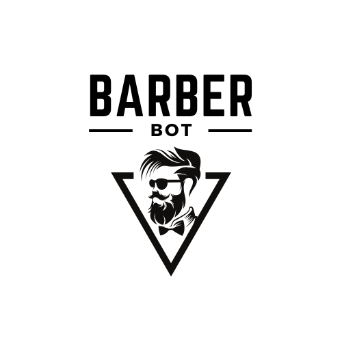

<p align="center">
  
</p>

<h1 align="center">Whatsapp Bot p/ Barbearia</h1>
<p align="center"><i
>Automatize sua barbearia com o Bot do WhatsApp: Agende, Consulte e Interaja!</i
></p>

<h4 align="center"> 
    🚧 Projeto em construção 🚧
</h4>

# Descrição do projeto
**Este projeto visa simplificar o atendimento ao cliente para barbearias, fornecendo uma solução automatizada e eficiente via WhatsApp.**

# 🔨 Funcionalidades

- [x] `Automação do Atendimento:` Receba mensagens dos clientes via WhatsApp Web, forneça respostas automáticas sobre **serviços, preços e agende compromissos.** Através de um menu personalizado por mensagens.
- [x] `Cadastrar e Gerenciar clientes:` Registre novos clientes e armazene em um banco de dados MySQL, **garantindo persistência dos dados** e consistência das interações
- [x] `Sistema de Fila:` Registre o cliente na fila e mostre o tempo médio de espera. ~~Marcar como atendido, adicionar, deletar e reorganizar a fila~~
- [ ] `SUPERUSER:` Terá o acesso a funcionalidades avançadas de gerenciamento: Ver, adicione, remova e atualize registros dos clientes no sistema; Adicionar, deletar ou reorganizar a fila; Acesso a algumas funcinalidades de análise de dados; Personalize algumas respostas automáticas; Suporte, Manutenção e sugestões.

- [ ] `Envio de MSG quando att a fila:` ...

- [ ] `Anti-Spam:` ...

# Layout


# 🛠️ Baixe e rode o projeto

```bash
# Clone este repositório
$ git clone https://github.com/vitumattos/bot-barbearia-zap.git

# Acesse a pasta do projeto no seu terminal
$ cd bot-barbearia-zap

# Crie uma venv e acesse-a
$ python -m venv .venv
$ .venv/scritps/activate

# Intalação das dependencias
$ pip install requirements.txt

#Execute o aplicativo
$ python ./main.py

# O Whatsapp web será aberto scanei o o códogo estará tudo pronto.
```

## ✔️ Técnicas e tecnologias utilizadas

- ``Python``
- ``selenium``
- ``PHP``
- ``MySQL``